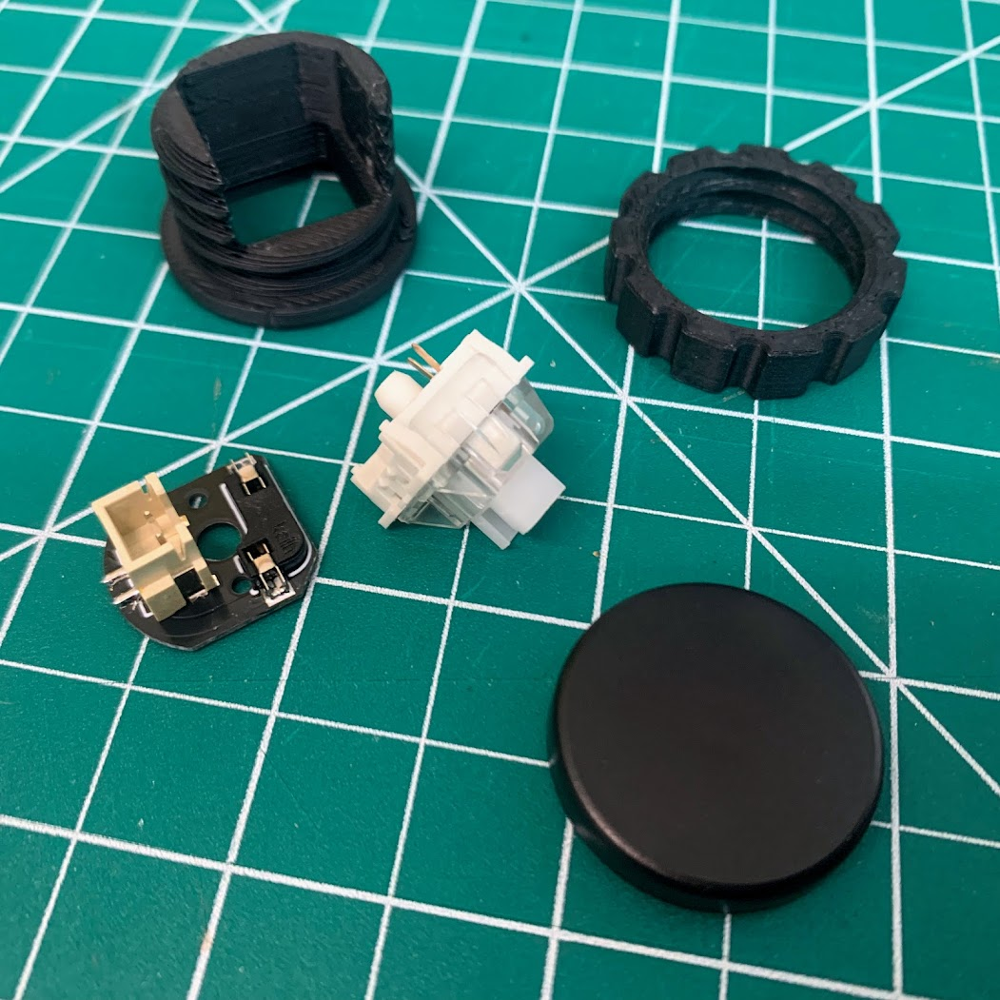
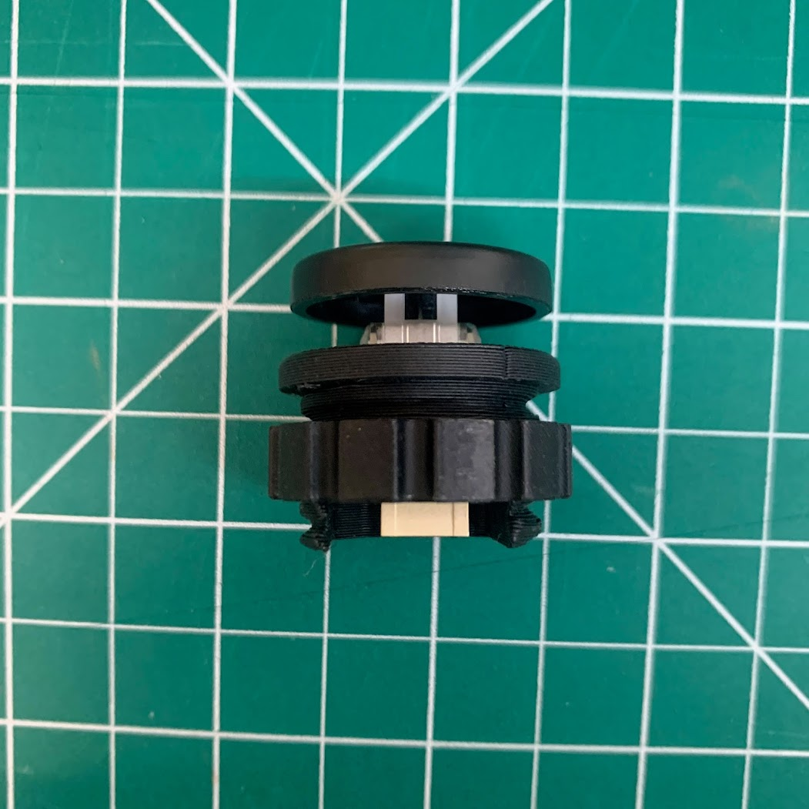
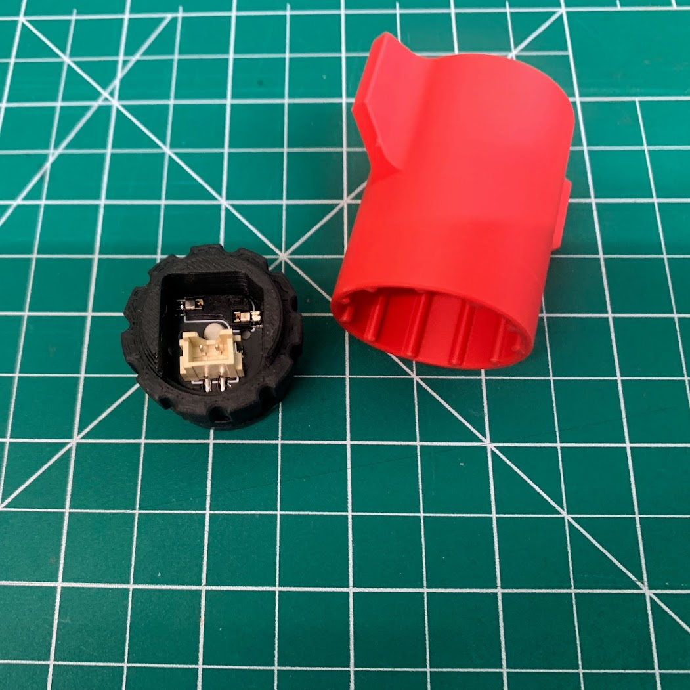
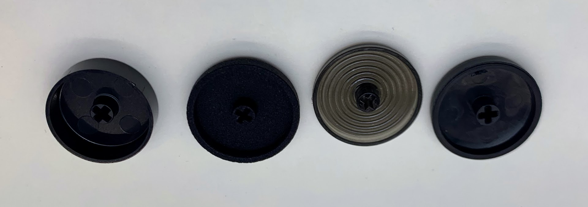
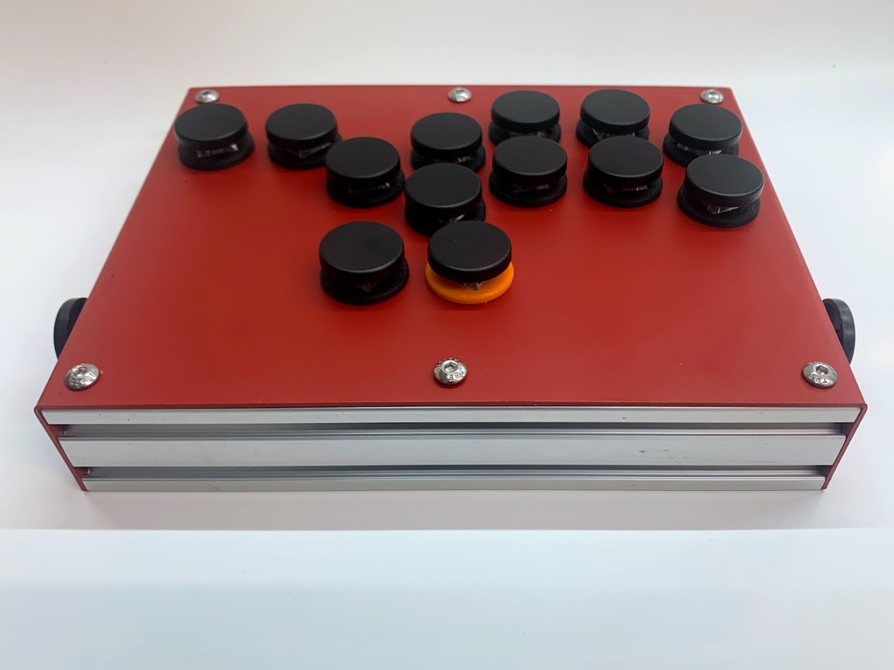

Open source Cherry MX based 24mm hole arcade button: 
Injection keycaps now available at [LeafCutterLabs.Com](https://leafcutterlabs.com/products/round-keycaps) 

The PCB gerber is included and confirmed to work.

Designed for 22-30mm caps. 26mm design is included in the files. 
From left to right Aliexpress 24mm, MJF printed 26mm (included in repo), Sinocade, LeafCutterLabs Injection

The MJF printed and LeafCutterLabs Injections are significantly thicker (1.6mm) to give a more substantial feel.

