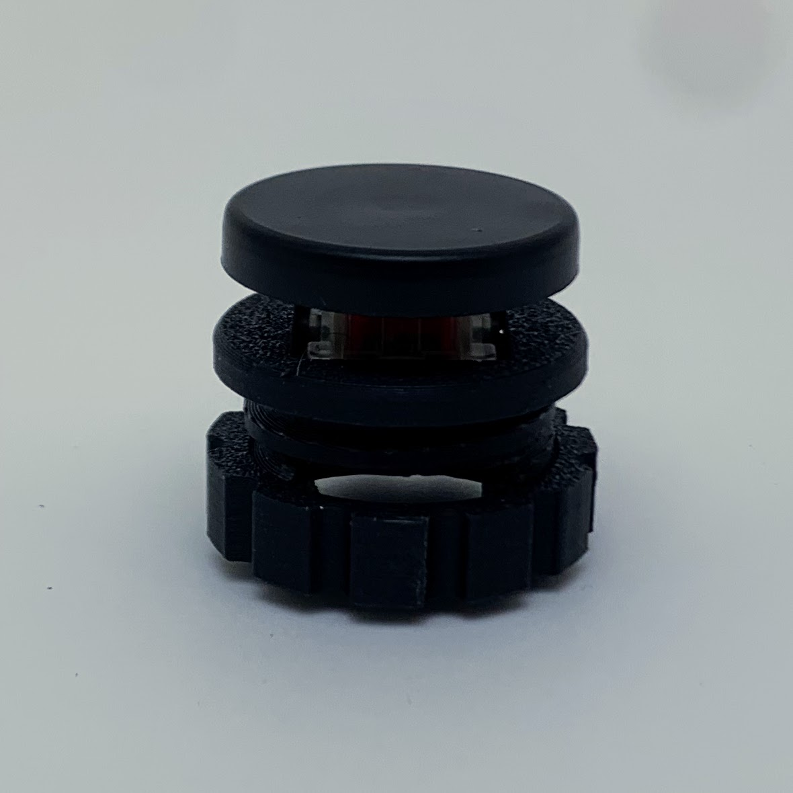
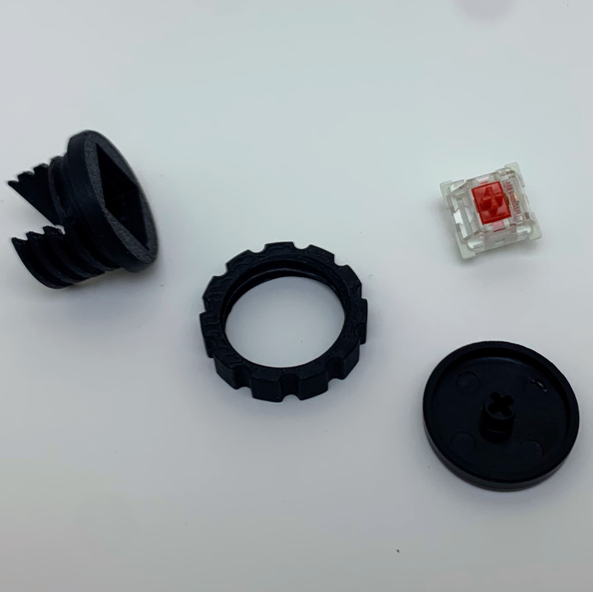
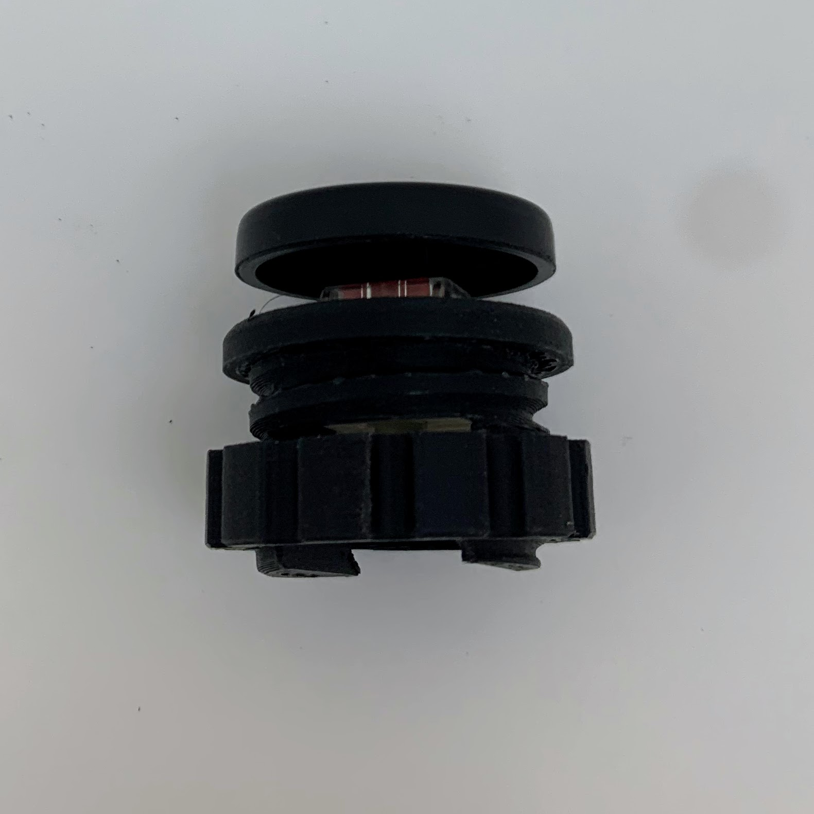
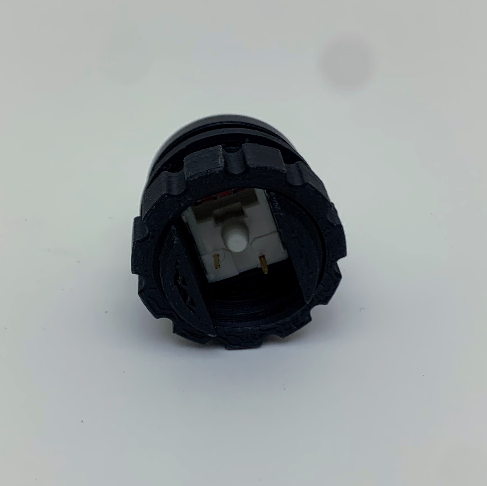
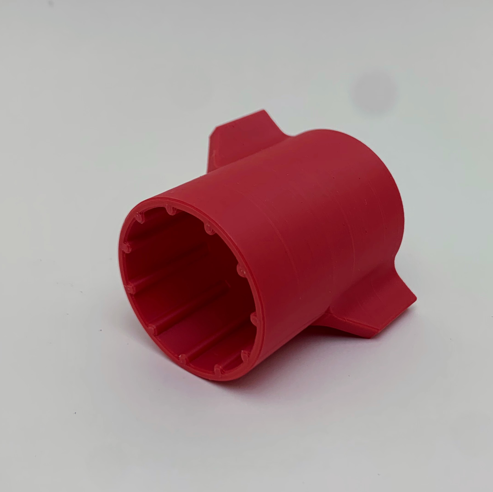
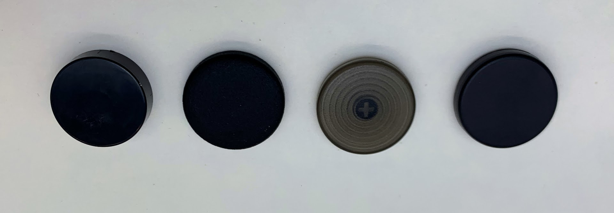
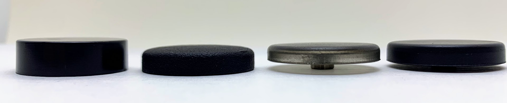

Open source Cherry MX based 24mm hole arcade button:
The PCB gerber is included but not confirmed to work, and update will occur once the boards are recieved.

Designed for 22-30mm caps. 26mm design is included in the files. Injection molded version will be available at leafcutterlabs.com in early October.

From left to right Aliexpress 24mm, MJF printed 26mm, Sinocade, LeafCutterLabs Injection 
